## Online Retail Data Clustering Project using RFM analysis

### Data Description 

- This Online Retail II data set contains all the transactions occurring for a UK-based and registered, non-store online retail between 01/12/2009 and 09/12/2011.The company mainly sells unique all-occasion gift-ware. Many customers of the company are wholesalers [Dataset link](https://archive.ics.uci.edu/dataset/502/online+retail+ii)

### Data Exploration

##### Import Necessary Libraries

``` python
import pandas as pd
import matplotlib.pyplot as plt
import seaborn as sns

from sklearn.cluster import KMeans
from sklearn.metrics import silhouette_score
from sklearn.preprocessing import StandardScaler

pd.options.display.float_format = '{:20.2f}'.format

pd.set_option('display.max_columns',999)
```


`df.info()`


- Insight
1. Null values present in customer id

`df.describe()`


- Insight
1. Quantity column has minimum value -80995
2. Price column has minimum value  -11062.06

### Data Cleaning

1. InvoiceNo: Invoice number. Nominal. A 6-digit integral number uniquely assigned to each transaction. If this code starts with the letter 'c', it indicates a cancellation.

`df["Invoice"].str.replace("[0-9]" , "",regex = True).unique()`
- But has array(['', 'C', 'A'], dtype=object)

```python
cleaned_df = df.copy()
cleaned_df["Invoice"] = cleaned_df["Invoice"].astype("str")
mask = (
    cleaned_df["Invoice"].str.match("^\\d{6}$") == True
)
cleaned_df = cleaned_df[mask]

cleaned_df
```


2. StockCode: Product (item) code. Nominal. A 5-digit integral number uniquely assigned to each distinct product.

```python
df["StockCode"] = df["StockCode"].astype("str")

code=df[(df["StockCode"].str.match("^\\d{5}$")==False) & (df["StockCode"].str.match("^\\d{5}[a-zA-Z]+$")== False)]["StockCode"].unique()
code
```
- array(['POST', 'D', 'C2', 'DOT', 'M', 'BANK CHARGES', 'S', 'AMAZONFEE',
       'DCGS0076', 'DCGS0003', 'gift_0001_40', 'DCGS0070', 'm',
       'gift_0001_50', 'gift_0001_30', 'gift_0001_20', 'DCGS0055',
       'DCGS0072', 'DCGS0074', 'DCGS0069', 'DCGS0057', 'DCGSSBOY',
       'DCGSSGIRL', 'gift_0001_10', 'PADS', 'DCGS0004', 'DCGS0073',
       'DCGS0071', 'DCGS0066P', 'DCGS0068', 'DCGS0067', 'B', 'CRUK'],
      dtype=object)

- But Stockcode column has differnt number rather than the 5-digit integral number

```python
cleaned_df["StockCode"] = cleaned_df["StockCode"].astype("str")

mask = (
    (cleaned_df["StockCode"].str.match("^\\d{5}$") == True)
    | (cleaned_df["StockCode"].str.match("^\\d{5}[a-zA-Z]+$") == True)
    | (cleaned_df["StockCode"].str.match("^PADS$") == True)
)

cleaned_df = cleaned_df[mask]

cleaned_df
```


- Cleaned dataframe


1. Dropped about 27% of record after cleaning

### Feature Engineering

`cleaned_df["SalesLineTotal"] = cleaned_df["Quantity"]*cleaned_df["Price"]`

### RFM Analysis Overview

###### RFM Analysis is a concept used by Data Science professionals, especially in the marketing domain for understanding and segmenting customers based on their buying behaviour.

###### Using RFM Analysis, a business can assess customers’:

1. recency (the date they made their last purchase)
2. frequency (how often they make purchases)
3. monetary value (the amount spent on purchases)

- Recency, Frequency, and Monetary value of a customer are three key metrics that provide information about customer engagement, loyalty, and value to a business.

``` python
aggregated_df = cleaned_df.groupby(by = "Customer ID" , as_index=False) .agg(
         MonetaryValue=("SalesLineTotal","sum"),
         Frequency = ("Invoice","nunique"),
         LastInvoiceDate=("InvoiceDate","max")
     )
aggregated_df.head(5)
```
```python
max_invoice_date = aggregated_df["LastInvoiceDate"].max()
aggregated_df["Recency"] = (max_invoice_date - aggregated_df["LastInvoiceDate"]).dt.days
aggregated_df.head(5)
```


### Analyzing the distribution of rfm values
```python
 plt.figure(figsize=(15,5))

plt.subplot(1,3,1)
plt.hist(aggregated_df['MonetaryValue'],bins=10,color='skyblue',edgecolor='black')
plt.title('Monetary value Distribution')
plt.xlabel('Monetary Value')
plt.ylabel('Count')

plt.subplot(1,3,2)
plt.hist(aggregated_df['Frequency'],bins=10,color='lightgreen',edgecolor='black')
plt.title('Frequency value Distribution')
plt.xlabel('Frequency Value')
plt.ylabel('Count')

plt.subplot(1,3,3)
plt.hist(aggregated_df['Recency'],bins=10,color='salmon',edgecolor='black')
plt.title('Recency value Distribution')
plt.xlabel('Recency Value')
plt.ylabel('Count')

plt.tight_layout()
plt.show()
```
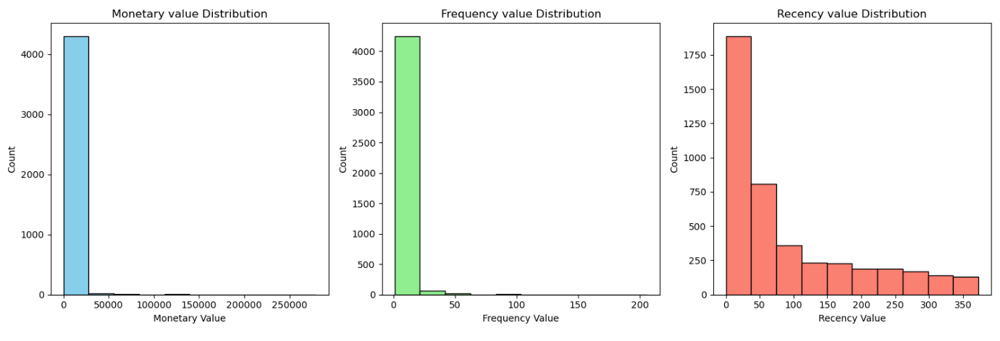

```python
plt.figure(figsize=(15, 5))

# Monetary Value Distribution
plt.subplot(1, 3, 1)
box1 = plt.boxplot(aggregated_df['MonetaryValue'], patch_artist=True, boxprops=dict(facecolor='skyblue', color='black'))
plt.title('Monetary Value Distribution')
plt.ylabel('Monetary Value')

# Frequency Value Distribution
plt.subplot(1, 3, 2)
box2 = plt.boxplot(aggregated_df['Frequency'], patch_artist=True, boxprops=dict(facecolor='lightgreen', color='black'))
plt.title('Frequency Value Distribution')
plt.ylabel('Frequency Value')

# Recency Value Distribution
plt.subplot(1, 3, 3)
box3 = plt.boxplot(aggregated_df['Recency'], patch_artist=True, boxprops=dict(facecolor='salmon', color='black'))
plt.title('Recency Value Distribution')
plt.ylabel('Recency Value')

plt.tight_layout()
plt.show()
```
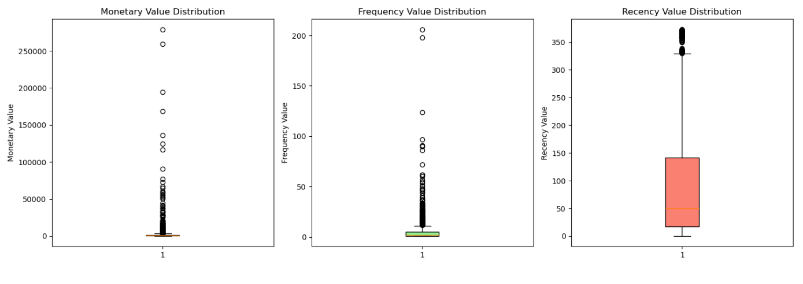

- Insights
1. Presence of Outliers

### Handling Outliers
```python
M_Q1=aggregated_df["MonetaryValue"].quantile(0.25)
M_Q3=aggregated_df["MonetaryValue"].quantile(0.75)
M_IQR = M_Q3-M_Q1
monetary_outliers_df = aggregated_df[(aggregated_df["MonetaryValue"]>(M_Q3 + 1.5*M_IQR)) |(aggregated_df["MonetaryValue"]<(M_Q1 - 1.5*M_IQR))]
monetary_outliers_df.describe()

F_Q1=aggregated_df["Frequency"].quantile(0.25)
F_Q3=aggregated_df["Frequency"].quantile(0.75)
F_IQR = F_Q3-F_Q1
frequency_outliers_df = aggregated_df[(aggregated_df["Frequency"]>(F_Q3 + 1.5*F_IQR)) |(aggregated_df["Frequency"]<(F_Q1 - 1.5*F_IQR))]
frequency_outliers_df.describe()

non_outliers_df = aggregated_df[(~aggregated_df.index.isin(monetary_outliers_df.index)) & (~aggregated_df.index.isin(frequency_outliers_df.index))]

non_outliers_df.describe()
```
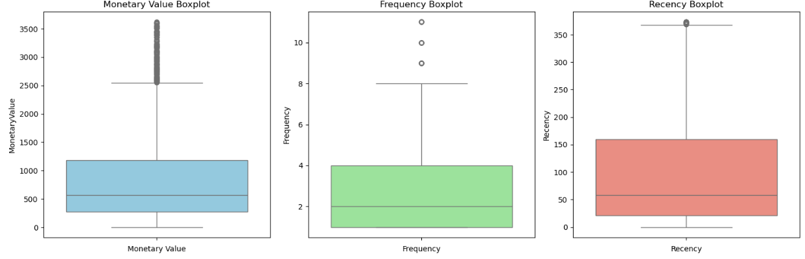

### Normalization

```python
scaler = StandardScaler()

scaled_data = scaler.fit_transform(non_outliers_df[["MonetaryValue","Frequency","Recency"]])

scaled_data
```

#### 3D Scatter Plot of Customer Data

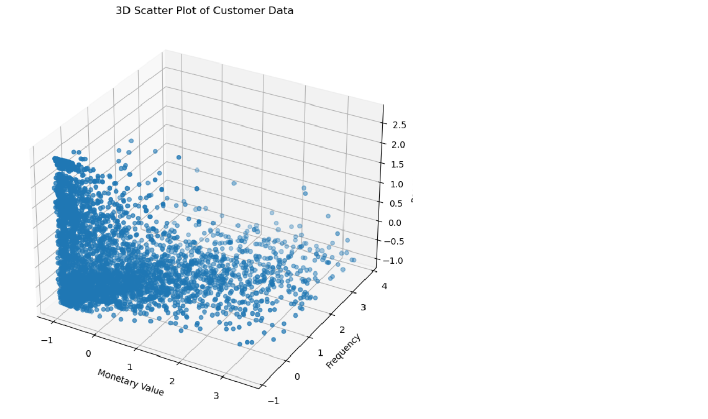

### Evaluation

1. Determine optimal K using the Elbow Method.
2. Silhouette Score

```python
max_k =12

inertia =[]
silhoutte_scores =[]
k_values = range(2,max_k+1)

for k in k_values:

    kmeans=KMeans(n_clusters=k,random_state=42,max_iter=1000)
    cluster_labels = kmeans.fit_predict(scaled_data_df)
    sil_score=silhouette_score(scaled_data_df,cluster_labels)
    silhoutte_scores.append(sil_score)
    inertia.append(kmeans.inertia_)
    
plt.figure(figsize=(14,6))
plt.subplot(1,2,1)
plt.plot(k_values,inertia,marker='o')
plt.title('KMeans Inertia for different values of k')
plt.xlabel('Number of Cluster (k)')
plt.ylabel('Inertia')
plt.xticks(k_values)
plt.grid(True)

plt.subplot(1, 2, 2)
plt.plot(k_values, silhoutte_scores, marker='o', color='orange')
plt.title('Silhouette Scores for Different Values of k')
plt.xlabel('Number of Clusters (k)')
plt.ylabel('Silhouette Score')
plt.xticks(k_values)
plt.grid(True)

plt.tight_layout()
plt.show()
```
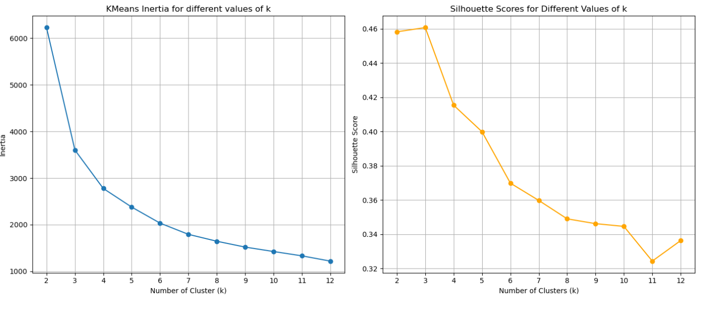

- Insights
1. After evaluating k value by using elbow method and silhouette score we come to k=4

### Modeling

#### K-Means Clustering:

- Apply clustering and label customer segments.

```python
kmeans = KMeans(n_clusters=4,random_state = 42, max_iter=1000)

cluster_labels = kmeans.fit_predict(scaled_data_df)

cluster_labels

non_outliers_df["Cluster"] = cluster_labels
non_outliers_df
```
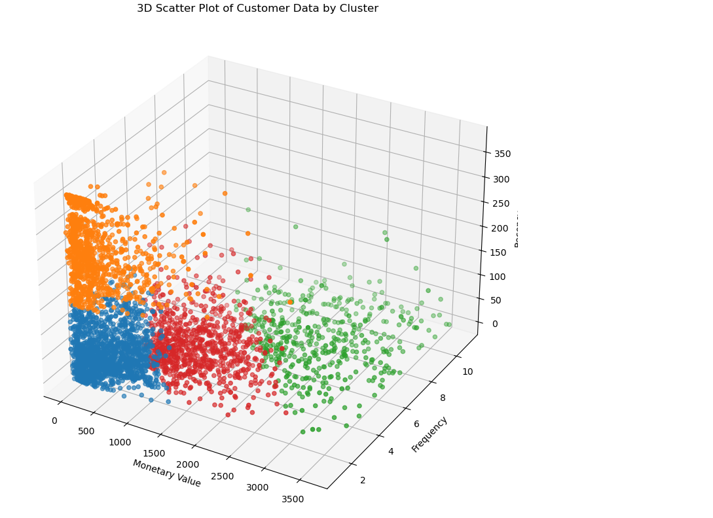

#### Segmenting the customer

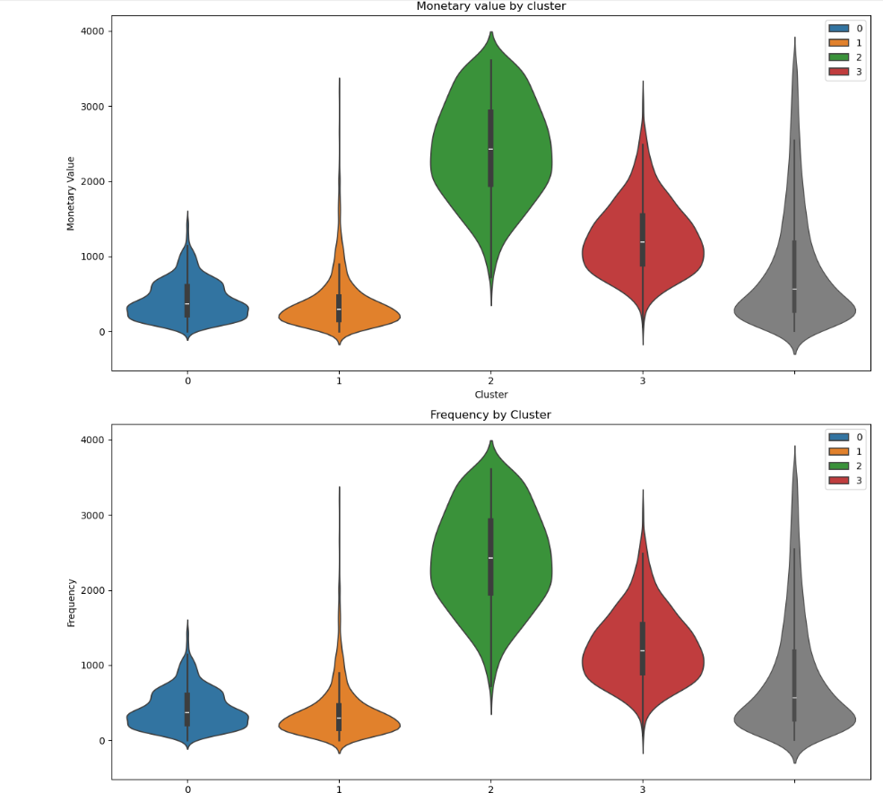
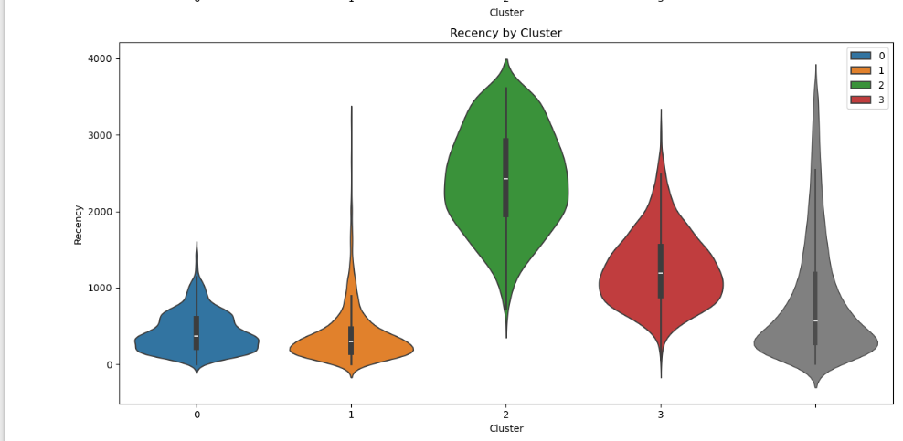

- Insights

**1. Cluster 0 (Blue): "Loyal Retainers"**

* Rationale: This cluster consists of high-value customers who make regular purchases, though their recent activity may vary. They are loyal, but it's crucial to keep their engagement high.
* Action: Implement retention strategies such as exclusive rewards, personalized offers, and regular communications to keep them loyal and maintain their spending habits.

  
**2.Cluster 1 (Orange): "Re-Engagement Targets"**

* Rationale: This group comprises customers who have lower purchase frequency and have not bought recently. Their spending has dropped, so the priority is bringing them back into the fold.
* Action: Re-engage through targeted campaigns, special offers, email reminders, or time-sensitive promotions to reignite their interest and increase purchasing activity.
  
**3.Cluster 2 (Green): "Growth Potential"**

* Rationale: These customers are less frequent and lower-value buyers, but they have recently made a purchase. They might be new or need nurturing to foster future spending.
* Action: Focus on relationship-building by offering excellent customer service, educational content, and incentives to increase their engagement and conversion into more frequent buyers.
  
**3.Cluster 3 (Red): "Top Performers"**

* Rationale: This cluster represents the highest-value customers who make frequent purchases and remain actively engaged. They are your most loyal and profitable segment.
* Action: Provide exclusive offers, loyalty bonuses, and VIP treatment to keep them engaged. Recognize their loyalty to further strengthen their bond with the brand.
  
**Summary of Cluster Names:**

* Cluster 0 (Blue): "Loyal Retainers"
* Cluster 1 (Orange): "Re-Engagement Targets"
* Cluster 2 (Green): "Growth Potential"
* Cluster 3 (Red): "Top Performers"

#### Segmenting the outlier customer
```python
overlap_indices = monetary_outliers_df.index.intersection(frequency_outliers_df.index)

monetary_only_outliers = monetary_outliers_df.drop(overlap_indices)
frequency_only_outliers = frequency_outliers_df.drop(overlap_indices)
monetary_and_frequency_outliers = monetary_outliers_df.loc[overlap_indices]

monetary_only_outliers["Cluster"] = -1
frequency_only_outliers["Cluster"] = -2
monetary_and_frequency_outliers["Cluster"] = -3

outlier_clusters_df = pd.concat([monetary_only_outliers, frequency_only_outliers, monetary_and_frequency_outliers])

outlier_clusters_df
```
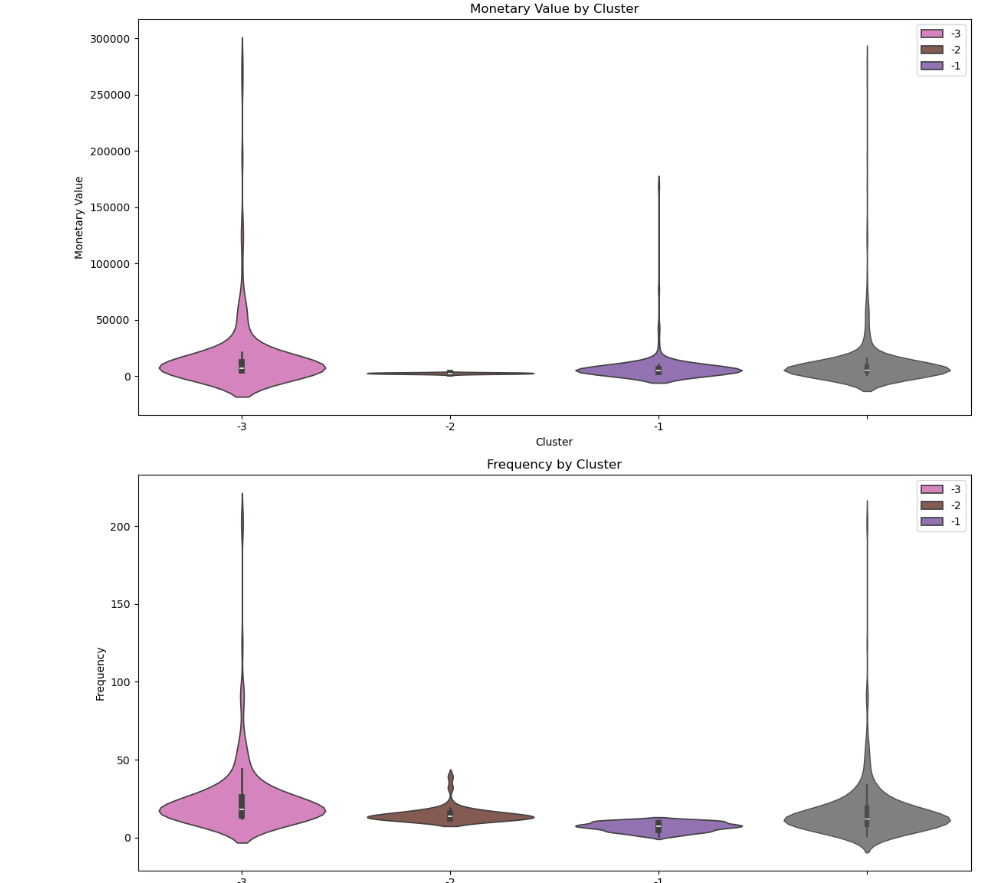
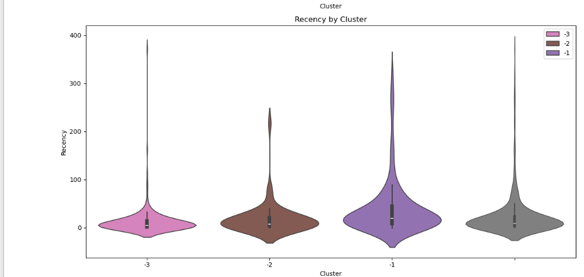

- Insights

**Cluster -1 (Monetary Outliers) – "Elite Spenders"**

* Characteristics: These customers make large but infrequent purchases, meaning they have a high monetary value but don’t shop regularly.
* Strategy:
Offer exclusive, high-end services such as VIP customer care or personalized recommendations.
* Use luxury incentives like early access to premium products or concierge services to keep them engaged.
* Send occasional but high-impact offers tailored to their past purchase history.
  
**Cluster -2 (Frequency Outliers) – "Frequent Shoppers"**
  
* Characteristics: These buyers shop often but spend less per transaction. They are highly engaged but could benefit from increased order values.
* Strategy:
Introduce bundled deals, discounts on bulk purchases, or tiered loyalty rewards to encourage larger transactions.
* Offer subscription models or membership programs that provide perks for higher spending.
Use cross-selling and upselling tactics by suggesting complementary products based on their buying habits.

**Cluster -3 (Monetary & Frequency Outliers) – "VIP Champions"**

* Characteristics: The most valuable customers—frequent buyers with exceptional spending habits. They contribute significantly to overall revenue and require top-tier engagement.
* Strategy:
Develop exclusive VIP programs with special rewards, invitations to private sales, and early product access.
* Provide priority support, personalized shopping experiences, or even dedicated account managers.
* Surprise them with unexpected perks (e.g., birthday gifts, personalized thank-you notes) to strengthen brand loyalty.
  
**Updated Cluster Names & Summary:**

* Cluster -1 (Monetary Outliers) → "Elite Spenders" (Focus on premium services & personalized engagement)
* Cluster -2 (Frequency Outliers) → "Frequent Shoppers" (Encourage upselling & higher basket sizes)
* Cluster -3 (Monetary & Frequency Outliers) → "VIP Champions" (Reward & retain ultra-valuable customers)

#### Labeling the Customer

```python
cluster_labels = {
    0: "Loyal Retainers",     # High-value, regular buyers – focus on retention
    1: "Dormant Re-Engage",   # Low-value, infrequent buyers – needs reactivation
    2: "Growth Potential",    # Recent buyers with low spending – nurture for higher engagement
    3: "Top Performers",      # High-value, high-frequency buyers – top-tier loyalists
    -1: "Elite Spenders",     # Infrequent but high-value spenders – personalize premium offerings
    -2: "Frequent Shoppers",  # Regular buyers with lower per-purchase spending – upselling opportunities
    -3: "VIP Champions"       # Highest-value and most engaged customers – maintain exclusivity
}

full_clustering_df = pd.concat([non_outliers_df, outlier_clusters_df])

full_clustering_df

full_clustering_df["ClusterLabel"] = full_clustering_df["Cluster"].map(cluster_labels)

full_clustering_df
```
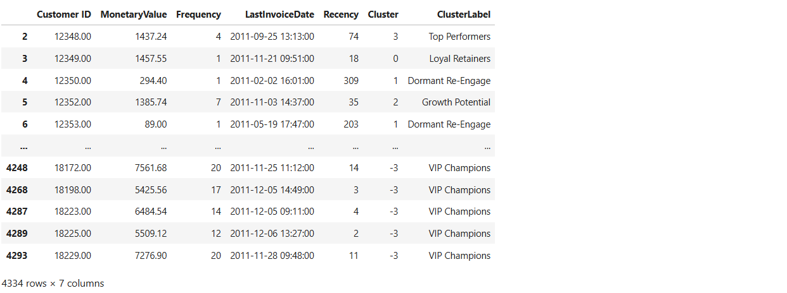

### Visualizing Clusters

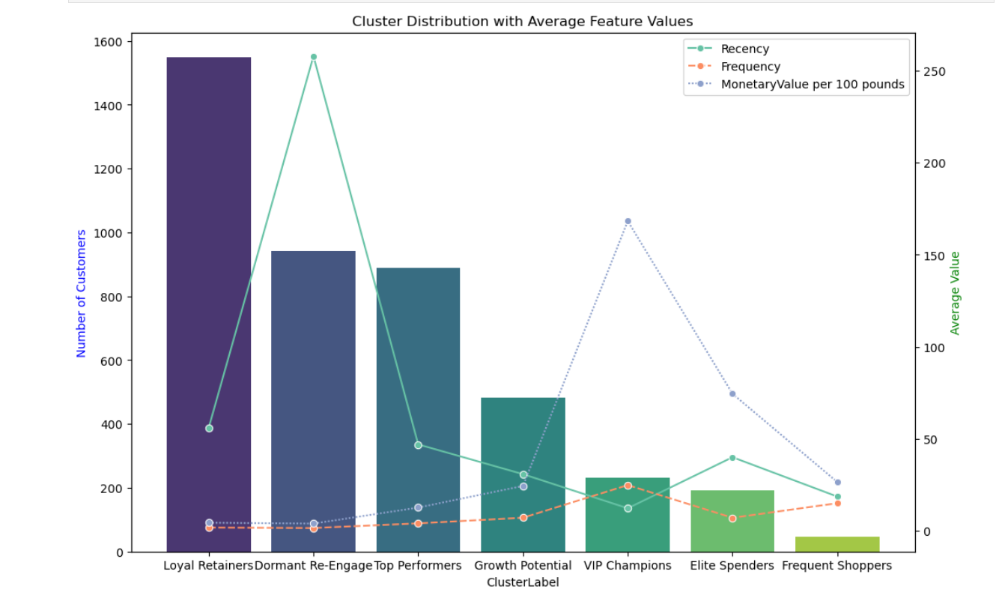