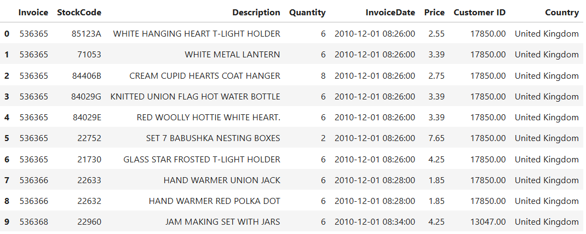
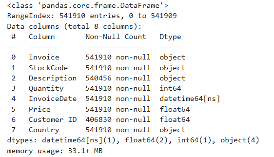
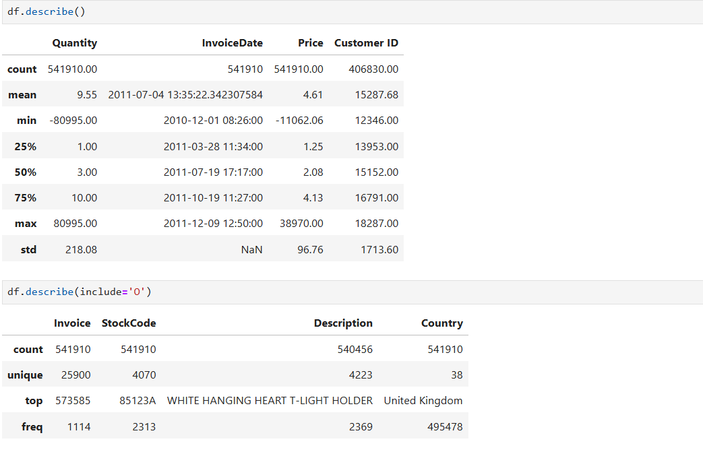

## Online Retail Data Clustering Project using RFM analysis

### Data Description 

- This Online Retail II data set contains all the transactions occurring for a UK-based and registered, non-store online retail between 01/12/2009 and 09/12/2011.The company mainly sells unique all-occasion gift-ware. Many customers of the company are wholesalers [Dataset link](https://archive.ics.uci.edu/dataset/502/online+retail+ii)

### Data Exploration

##### Import Necessary Libraries

``` python
import pandas as pd
import matplotlib.pyplot as plt
import seaborn as sns

from sklearn.cluster import KMeans
from sklearn.metrics import silhouette_score
from sklearn.preprocessing import StandardScaler

pd.options.display.float_format = '{:20.2f}'.format

pd.set_option('display.max_columns',999)
```


`df.info()`




- Insight
1. Null values present in customer id

`df.describe()`




- Insight
1. Quantity column has minimum value -80995
2. Price column has minimum value  -11062.06

### Data Cleaning

1. InvoiceNo: Invoice number. Nominal. A 6-digit integral number uniquely assigned to each transaction. If this code starts with the letter 'c', it indicates a cancellation.

`df["Invoice"].str.replace("[0-9]" , "",regex = True).unique()`
- But has array(['', 'C', 'A'], dtype=object)

```python
cleaned_df = df.copy()
cleaned_df["Invoice"] = cleaned_df["Invoice"].astype("str")
mask = (
    cleaned_df["Invoice"].str.match("^\\d{6}$") == True
)
cleaned_df = cleaned_df[mask]

cleaned_df
```
