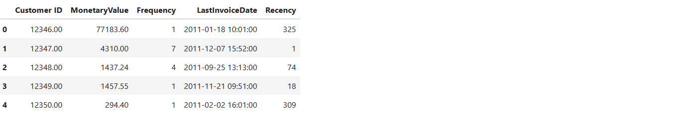

## Online Retail Data Clustering Project using RFM analysis

### Data Description 

- This Online Retail II data set contains all the transactions occurring for a UK-based and registered, non-store online retail between 01/12/2009 and 09/12/2011.The company mainly sells unique all-occasion gift-ware. Many customers of the company are wholesalers [Dataset link](https://archive.ics.uci.edu/dataset/502/online+retail+ii)

### Data Exploration

##### Import Necessary Libraries

``` python
import pandas as pd
import matplotlib.pyplot as plt
import seaborn as sns

from sklearn.cluster import KMeans
from sklearn.metrics import silhouette_score
from sklearn.preprocessing import StandardScaler

pd.options.display.float_format = '{:20.2f}'.format

pd.set_option('display.max_columns',999)
```


`df.info()`


- Insight
1. Null values present in customer id

`df.describe()`


- Insight
1. Quantity column has minimum value -80995
2. Price column has minimum value  -11062.06

### Data Cleaning

1. InvoiceNo: Invoice number. Nominal. A 6-digit integral number uniquely assigned to each transaction. If this code starts with the letter 'c', it indicates a cancellation.

`df["Invoice"].str.replace("[0-9]" , "",regex = True).unique()`
- But has array(['', 'C', 'A'], dtype=object)

```python
cleaned_df = df.copy()
cleaned_df["Invoice"] = cleaned_df["Invoice"].astype("str")
mask = (
    cleaned_df["Invoice"].str.match("^\\d{6}$") == True
)
cleaned_df = cleaned_df[mask]

cleaned_df
```


2. StockCode: Product (item) code. Nominal. A 5-digit integral number uniquely assigned to each distinct product.

```python
df["StockCode"] = df["StockCode"].astype("str")

code=df[(df["StockCode"].str.match("^\\d{5}$")==False) & (df["StockCode"].str.match("^\\d{5}[a-zA-Z]+$")== False)]["StockCode"].unique()
code
```
- array(['POST', 'D', 'C2', 'DOT', 'M', 'BANK CHARGES', 'S', 'AMAZONFEE',
       'DCGS0076', 'DCGS0003', 'gift_0001_40', 'DCGS0070', 'm',
       'gift_0001_50', 'gift_0001_30', 'gift_0001_20', 'DCGS0055',
       'DCGS0072', 'DCGS0074', 'DCGS0069', 'DCGS0057', 'DCGSSBOY',
       'DCGSSGIRL', 'gift_0001_10', 'PADS', 'DCGS0004', 'DCGS0073',
       'DCGS0071', 'DCGS0066P', 'DCGS0068', 'DCGS0067', 'B', 'CRUK'],
      dtype=object)

- But Stockcode column has differnt number rather than the 5-digit integral number

```python
cleaned_df["StockCode"] = cleaned_df["StockCode"].astype("str")

mask = (
    (cleaned_df["StockCode"].str.match("^\\d{5}$") == True)
    | (cleaned_df["StockCode"].str.match("^\\d{5}[a-zA-Z]+$") == True)
    | (cleaned_df["StockCode"].str.match("^PADS$") == True)
)

cleaned_df = cleaned_df[mask]

cleaned_df
```


- Cleaned dataframe


1. Dropped about 27% of record after cleaning

### Feature Engineering

`cleaned_df["SalesLineTotal"] = cleaned_df["Quantity"]*cleaned_df["Price"]`

### RFM Analysis Overview

###### RFM Analysis is a concept used by Data Science professionals, especially in the marketing domain for understanding and segmenting customers based on their buying behaviour.

###### Using RFM Analysis, a business can assess customers’:

1. recency (the date they made their last purchase)
2. frequency (how often they make purchases)
3. monetary value (the amount spent on purchases)

- Recency, Frequency, and Monetary value of a customer are three key metrics that provide information about customer engagement, loyalty, and value to a business.

``` python
aggregated_df = cleaned_df.groupby(by = "Customer ID" , as_index=False) .agg(
         MonetaryValue=("SalesLineTotal","sum"),
         Frequency = ("Invoice","nunique"),
         LastInvoiceDate=("InvoiceDate","max")
     )
aggregated_df.head(5)
```
```python
max_invoice_date = aggregated_df["LastInvoiceDate"].max()
aggregated_df["Recency"] = (max_invoice_date - aggregated_df["LastInvoiceDate"]).dt.days
aggregated_df.head(5)
```
